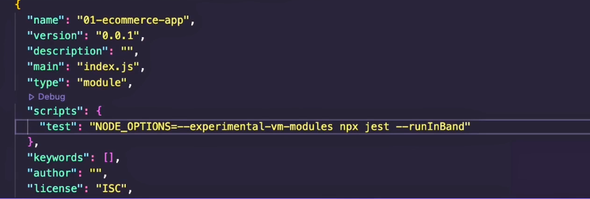

# 18 June

1. Install jest@26 and jest@28 and `npx jest --init`
2. Update the jest config like this
   

3. Update the package.json like this
   

4. Create index.js inside the test
   

5. Create paymentSubject inside the subject folder
   

6. Create shipment and marketing file and add this content
   

7. Create payment.js inside the event folder
   

8. Update the marketing observable and shipment like this
   
