# 19 June

## Buffer

1. First example, It shows basic functionality of using buffer. See Below code will throw an error because we are out of range. It allocates 5 bytes from operating system.
   

2. This example demonstrates

   1. How can we copy from one buffer to another buffer.
   2. How buffer ignore the character
   3. 

3. If we want to allocate dynamically
   

4. We can achieve the same thing using `Buffer.from`
   

5. Converting chars to hexa decimal and decimal. We can work with hexadecimal, ascii code with buffer.
   
   

6. To generate the 1 to 100 sequence in node js and store it in text.txt file

- `for i in `seq 1 100`; do node -e "process.stdout.write('$i-hello world\n')" >> text.txt; done`

7. How to process data in chunks
   1. 
   2. 

## Streams

1. Change the script
   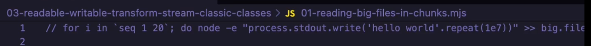

2. Read the file and see what happen
   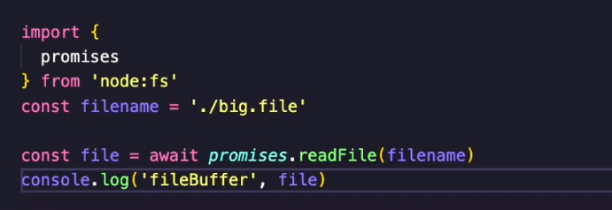

3. Consuming data example
   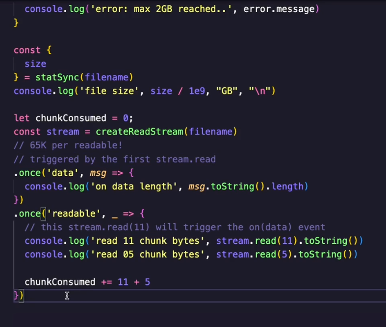

4. Consuming all data example
   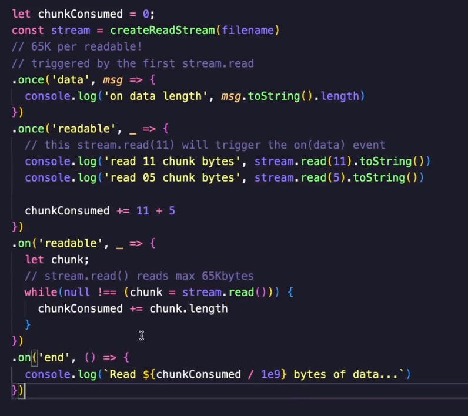

5. Create stream type.mjs file(18.28)

   1. 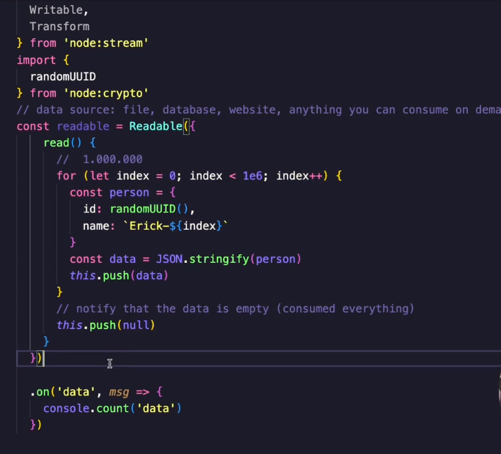
   2. Usually we don't create readable from scratch

6. Transforming readable stream from one form to another
   
   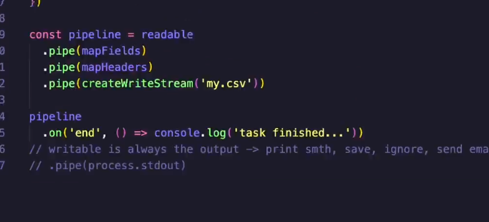

## Duplex

1. Basic example using duplex
   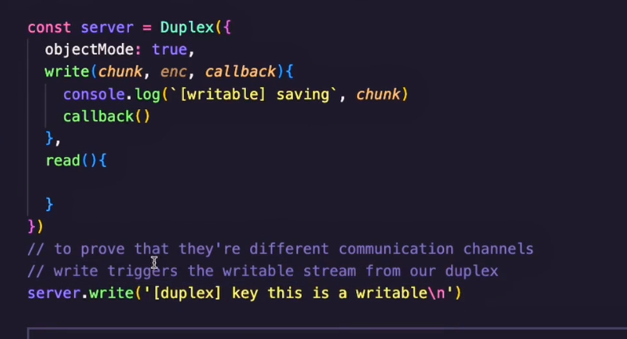
   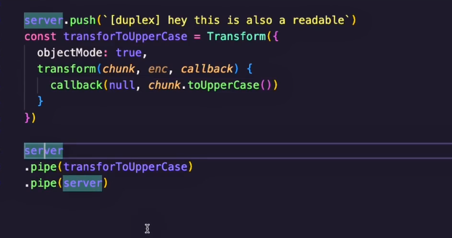

2. Implementing read function in above duplex
   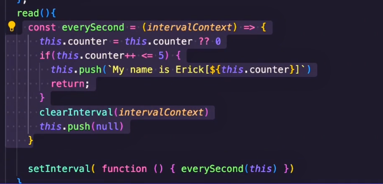
   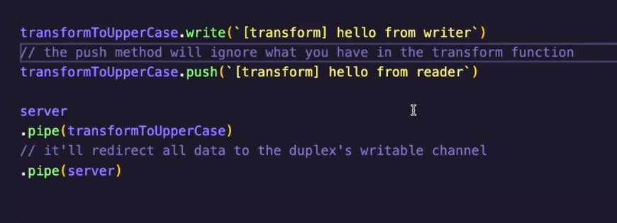

3. create duplex-broadcast.mjs
   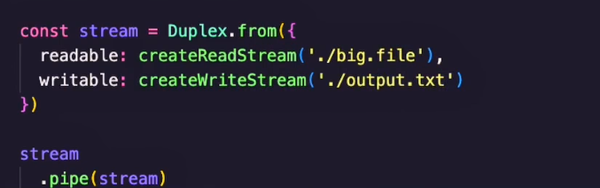
   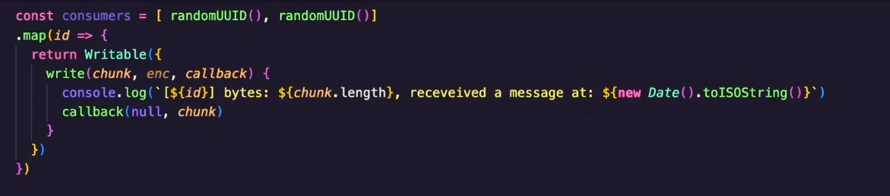
   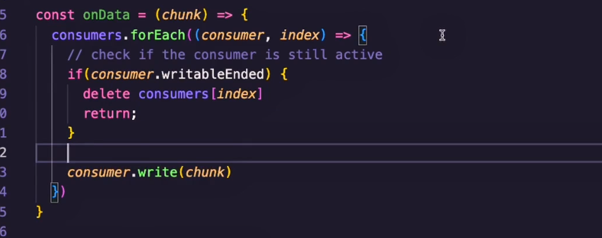
   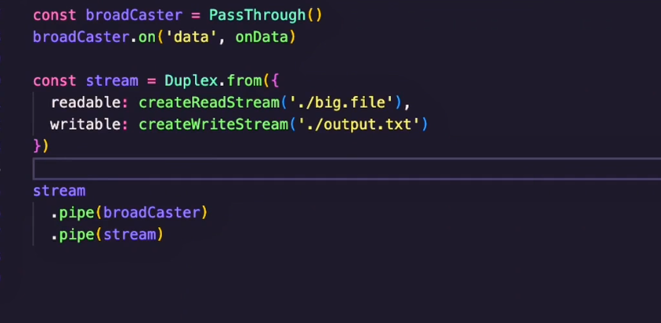

# 20 June

## Chat app

1. Create server.mjs and client.mjs.
2. Create server.mjs like this
   1. 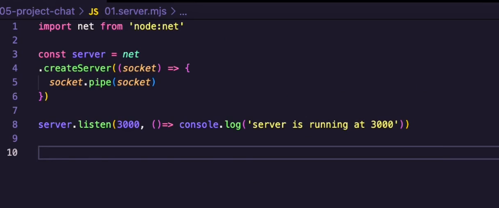
   2. 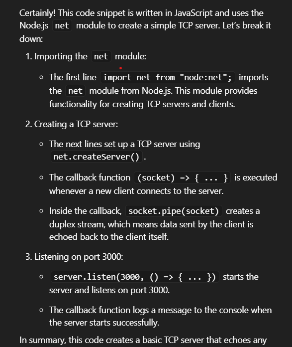
   3. 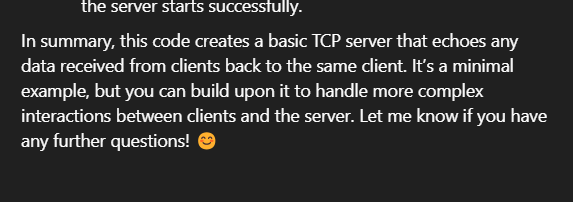
3. How it is different from app.listen in express js

   1. 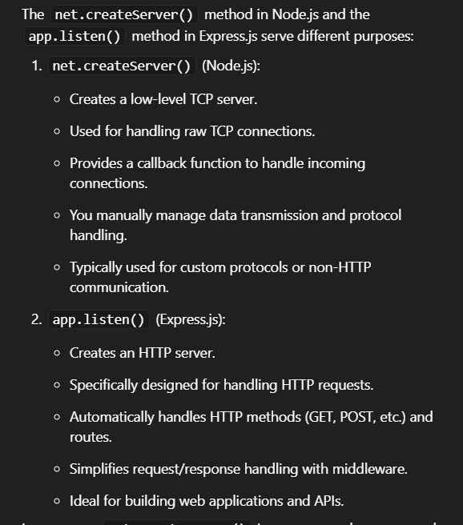
   2. 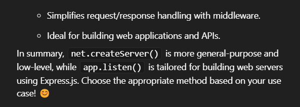

4. What is difference between http server and tcp server?

   1. 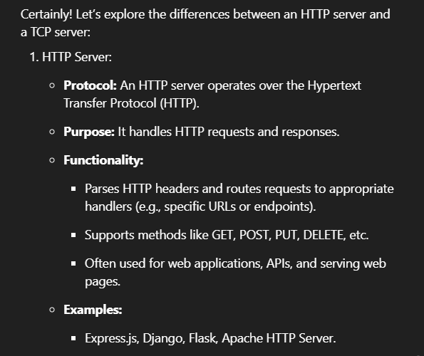
   2. 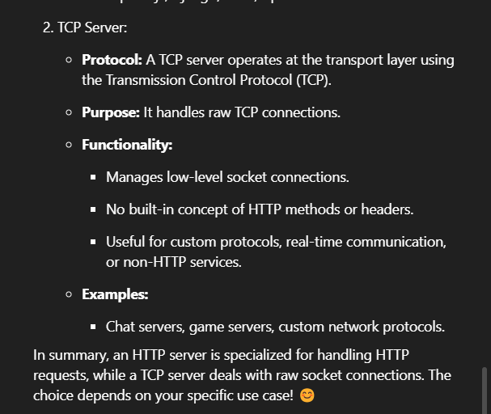

5. Add this code in client.mjs

   1. 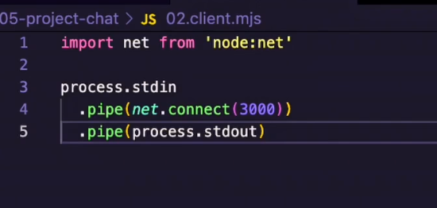

6. Add this code on server
   1. 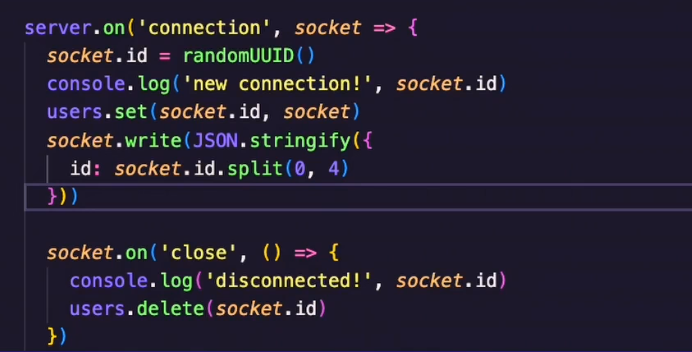
   2. We are just assigning id to client and store it in map.
   3. Whenever client closes the connection we removed it from map.
7. Create log function like this on client
   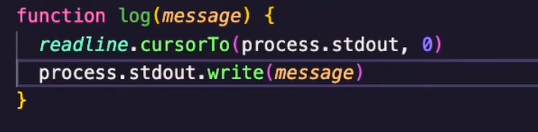

8. Create Writable stream in client like this
   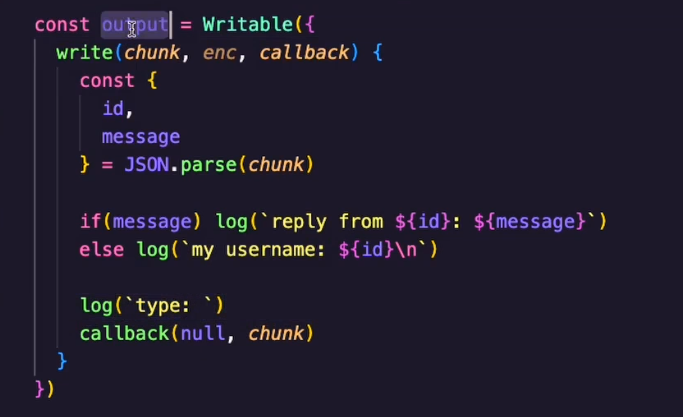

9. Create streamBroadcaster and notifySubscriber function
   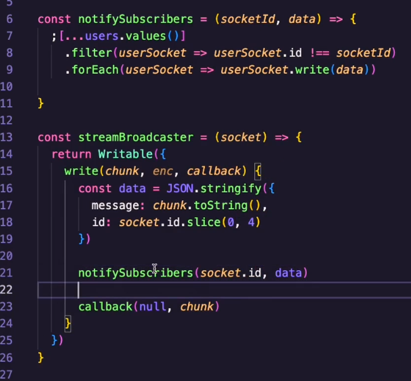

10. On frontend just use passthrough like this
    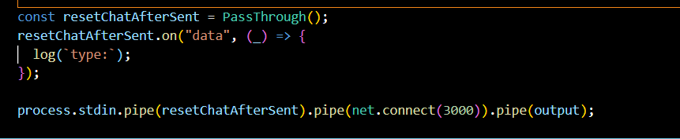

# 4 July

## Pipe vs pipeline

1. Create big file
   // node -e "process.stdout.write('hello world'.repeat(1e7))" > big.file

2. Create server and read the big file like this
   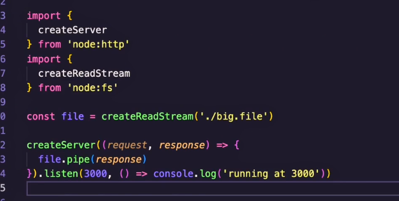

3. run the server and send curl request `curl localhost:3000`
4. Using pipe we can consume parital data.
5. This is the example using pipeline
   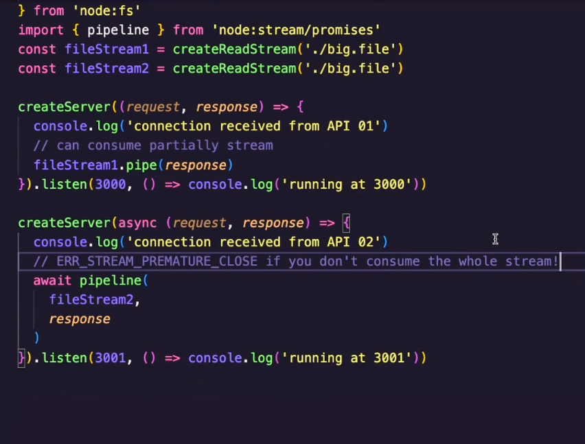
