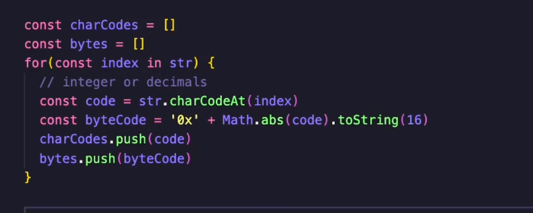
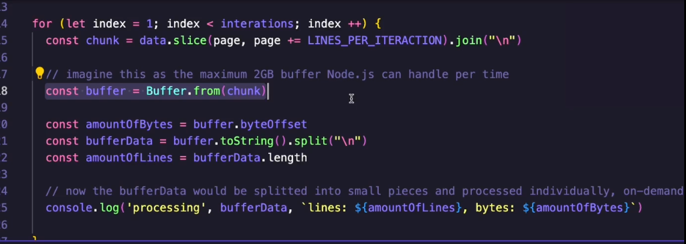
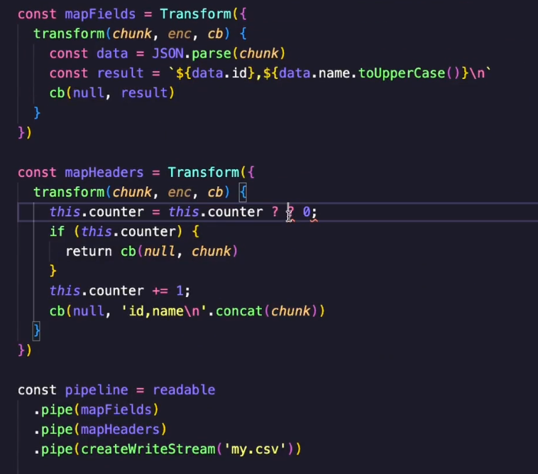

# 19 June

## Buffer

1. First example, It shows basic functionality of using buffer. See Below code will throw an error because we are out of range. It allocates 5 bytes from operating system.
   

2. This example demonstrates

   1. How can we copy from one buffer to another buffer.
   2. How buffer ignore the character
   3. 

3. If we want to allocate dynamically
   

4. We can achieve the same thing using `Buffer.from`
   

5. Converting chars to hexa decimal and decimal. We can work with hexadecimal, ascii code with buffer.
   
   

6. To generate the 1 to 100 sequence in node js and store it in text.txt file

- `for i in `seq 1 100`; do node -e "process.stdout.write('$i-hello world\n')" >> text.txt; done`

7. How to process data in chunks
   1. 
   2. 

## Streams

1. Change the script
   

2. Read the file and see what happen
   

3. Consuming data example
   

4. Consuming all data example
   

5. Create stream type.mjs file(18.28)

   1. 
   2. Usually we don't create readable from scratch

6. Transforming readable stream from one form to another
   
   

## Duplex

1. Basic example using duplex
   
   

2. Implementing read function in above duplex
   
   

3. create duplex-broadcast.mjs
   
   
   
   
